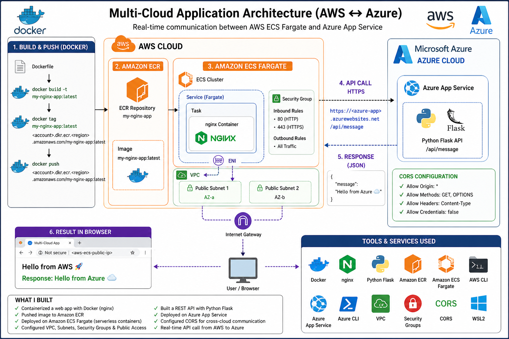
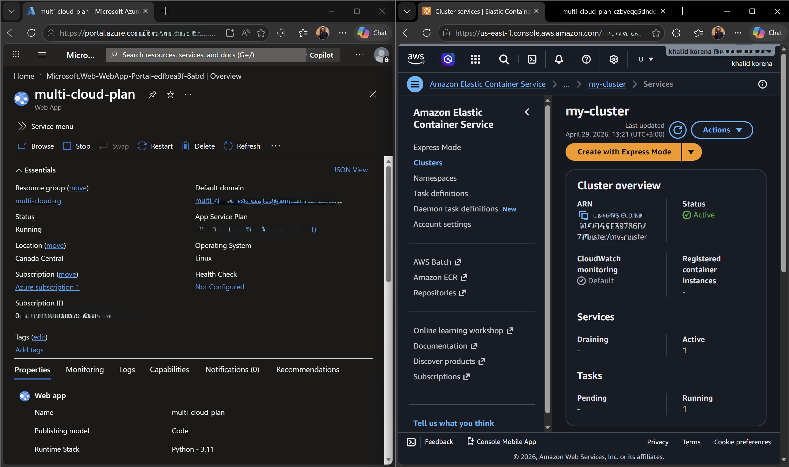
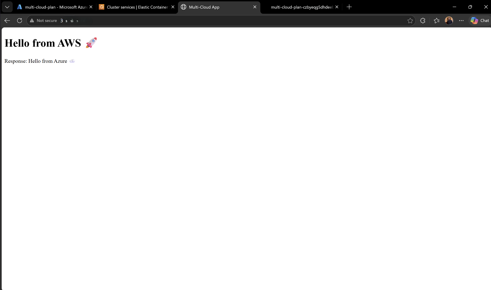

# 🌐 Multi-Cloud Application (AWS ↔ Azure)

A real-world multi-cloud project demonstrating containerization, deployment, and cross-cloud communication.

---

## ☁️ Architecture

- AWS ECS (Fargate) hosts nginx container  

---

- Amazon ECR stores Docker image  

---

- Azure App Service hosts Flask API  

---

- AWS communicates with Azure via HTTPS  

---

## 🔗 Flow

User → AWS ECS → Azure API → Response → User

---

## 🛠️ Tech Stack

- Docker  
- nginx  
- Python Flask  
- AWS ECS (Fargate)  
- Amazon ECR  
- Azure App Service  

---

## 🚀 Author

Khalid Korena
